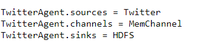
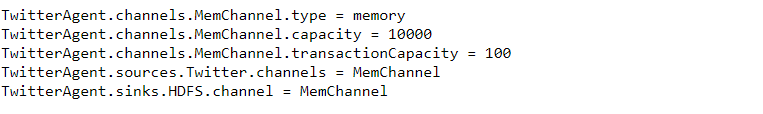

# Proyecto 3 BigData - TET

**Materia:** Tópicos especiales en telemática

**Problema a trabajar:**
	Realizar una prueba de concepto o demo sobre Data Streaming desde Twitter utilizando una de las siguientes tecnologías: Kafka, Storm, Flink o Flume.**

**Contenidos:**
- [Integrantes](#Integrantes)
- [Documentación](#Documentación)
	- [analisis-draft.md](analisis-draft.md)
	-  [analisis.md](analisis.md)
	-  [diseño+implementación.md](diseño+implementacion.md)
-  [Instalación y configuración](#Instalación-y-configuración)
	- [Apache Flume](#Apache-Flume)
	- [Spark-NLP](#Spark-NLP)

## Integrantes

**Profesor:**
- Edwin Nelson Montoya Munera

**Estudiantes:**
- José Orlando Rengifo Caicedo
- Ivan Santiago Vargas Ortega

## Documentación

- **[analisis-draft.md](analisis-draft.md):**

	Este documento contiene un  breve acercamiento al tema tratado  en este proyecto con respectiva diferenciación con el fin de dar una introducción a los temas tratados a continuación.
	
- **[analisis.md:](analisis.md)**

	Análisis mas detallado acerca del proyecto a trabajar, ademas abordando mas profundamente los temas de arquitecturas de datos y como estos interactuan con el software a utilizar.
	
	1.  Problema a resolver.
	2.  Arquitectura preliminar de datos (ciclo de vida, almacenamiento, procesamiento).
	3.  Fuentes y naturaleza de los datos + tecnologías a utilizar.
	4.  Sistema de ingesta de datos + tecnologías a utilizar.
	5.  Almacenamiento de los datos + tecnologías a utilizar.
	6.  Análisis de datos + tecnologías a utilizar.
	
- **[diseño+implementación.md:](diseño+implementacion.md)**

	Aqui se aborda a profundidad la arquitectura del software a utilizar para la solución de nuestro proyecto.

## Instalación y configuración

Aquí podrás encontrar el paso a paso del proceso de instalación de las tecnologías usadas.

### Apache Flume

#### Instalación y configuración

**Video tutorial:**[¿Como configurar Apache Flume?](https://www.youtube.com/watch?v=xZ2LL1nPvzI)

 1 **Configuración inicial**
 
 
 
2.**Palabras claves  y configuración de la fuente** 
 
3.**Sitio de almacenamiento de información y sincronización**

4.**Capacidad de la memoria y canal de configuración**

 

(http://flume.apache.org/download.html)

### Crear Aplicacion en Twitter
Después de tener una cuenta en Twitter, se debe solicitar permisos de desarrollador**, explicando el poque se quiere tener estos permisos y que se queire hacer con la aplicacion, ya luego de ser confirmado se debe llenar una información basica y ya brinda las Keys para la app. 

	

### Spark-NLP
	
#### Instalación y configuración
http://10.131.137.183:9995/#/
<!--stackedit_data:
eyJoaXN0b3J5IjpbMTQ4NTU3MjU3MiwtOTA0ODAzMjYxLC0xNj
IwNzQxMTgyLDE0MjgwMzM0MzYsLTMyMDc0NzQsMTczMTUyNDI1
NCwxMTE4MTcxMjUxLDExMTc3ODYyNTYsLTcwMTM4MTcyMiwtMT
Y4ODM1MTY4OSw4NTQ2MzMyNDksLTE2NjYwODk0NywxNDEyMjgy
MTIxLDk3MDU0NDQyOSw2MDc5MzE4MzYsNTAwMjI2OTI5LDIwMD
M1MzAzNzksLTIxMTUzMDI2MjMsMzM3Mjc4MDUwLC0xMTUxODYx
MDgwXX0=
-->